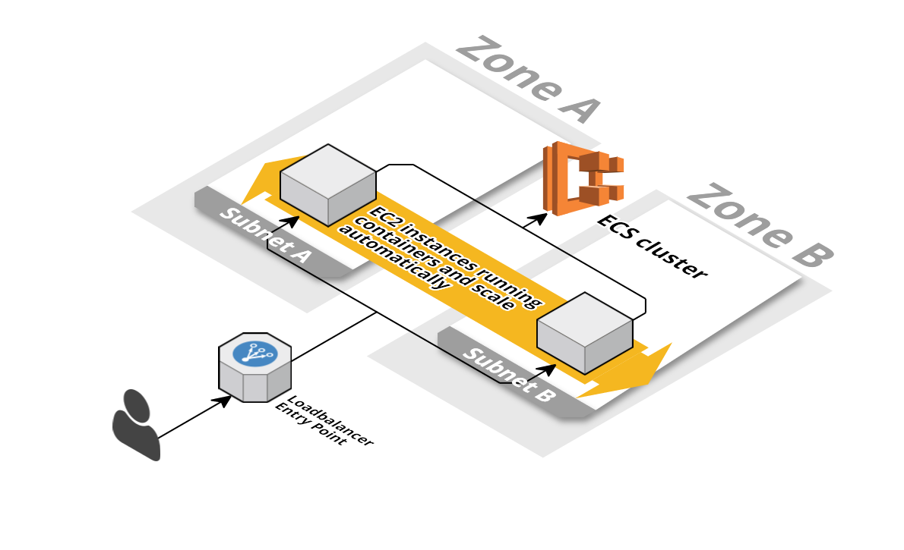
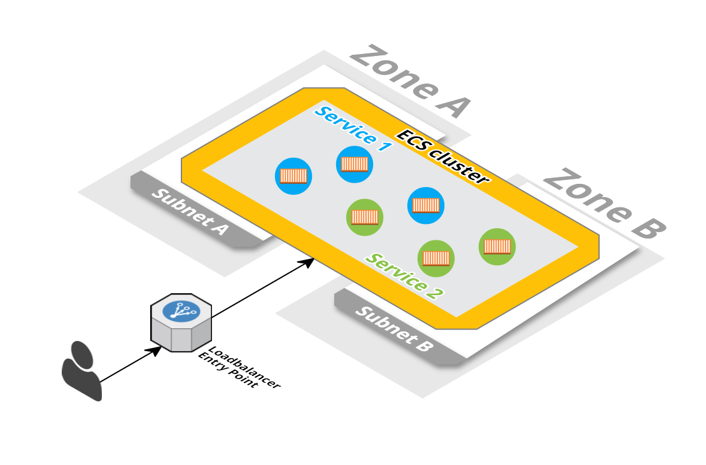
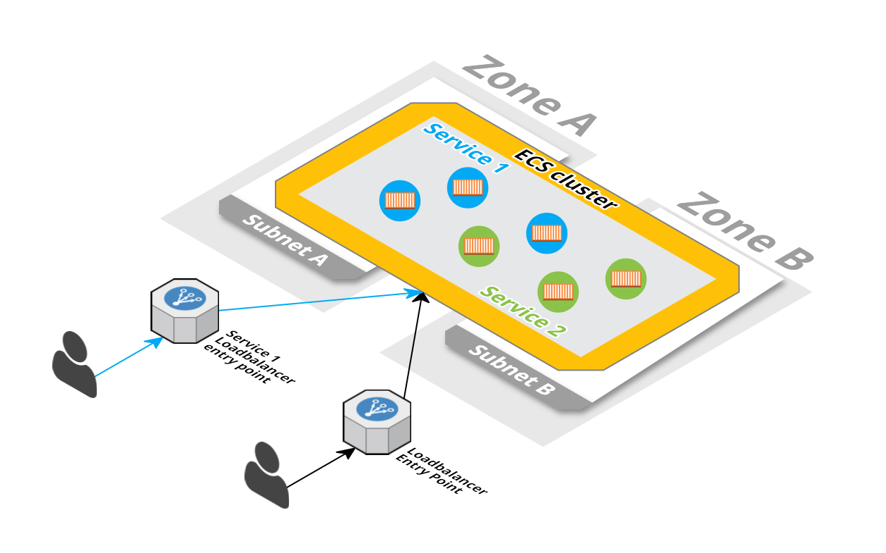

<iframe src="https://ghbtns.com/github-btn.html?user=widdix&repo=aws-cf-templates&type=star&count=true&size=large" frameborder="0" scrolling="0" width="160px" height="30px"></iframe>

> **New**: [Become a sponsor](https://github.com/sponsors/widdix) via GitHub Sponsors!

[EC2 Container Service (ECS)](https://aws.amazon.com/ecs/) is a highly scalable, fast, container management service that makes it easy to run, stop, and manage Docker containers on a cluster of Amazon EC2 instances. To run an application on ECS you need the following components:

* Docker image published to [Docker Hub](https://hub.docker.com/) or [EC2 Container Registry (ECR)](https://aws.amazon.com/ecr/)
* ECS cluster
* ECS service

We provide you templates for the ECS cluster and the service. You need to publish the Docker image.

# ECS cluster
This template describes a fault tolerant and scalable ECS cluster on AWS. The cluster scales the underlying EC2 instances based on memory and CPU reservation. In case of a scale down, the instance drains all containers before it is terminated.

Amazon S3 URL: `https://s3-eu-west-1.amazonaws.com/widdix-aws-cf-templates-releases-eu-west-1/__VERSION__/ecs/cluster.yaml`

## Installation Guide
1. This template depends on one of our [`vpc-*azs.yaml`](./vpc/) templates. 
1. 
1. Click **Next** to proceed with the next step of the wizard.
1. Specify a name and all parameters for the stack.
1. Click **Next** to proceed with the next step of the wizard.
1. Click **Next** to skip the **Options** step of the wizard.
1. Check the **I acknowledge that this template might cause AWS CloudFormation to create IAM resources.** checkbox.
1. Click **Create** to start the creation of the stack.
1. Wait until the stack reaches the state **CREATE_COMPLETE**

## Dependencies
* `vpc/vpc-*azs.yaml` (**required**)
* `vpc/vpc-*-bastion.yaml` (recommended)
* `operations/alert.yaml` (recommended)
* `security/auth-proxy-*.yaml`
* `security/waf.yaml`
* `state/s3.yaml`
* `state/client-sg.yaml`

# ECS cluster (cost optimzed)
This template describes a fault tolerant, scalable, and cost optimized ECS cluster on AWS. The cluster scales out event driven and scales in based on memory and CPU reservation. In case of a scale down, the instance drains all containers before it is terminated.

Amazon S3 URL: `https://s3-eu-west-1.amazonaws.com/widdix-aws-cf-templates-releases-eu-west-1/__VERSION__/ecs/cluster-cost-optimized.yaml`

## Installation Guide
1. This templates depends on one of our [`vpc-*azs.yaml`](./vpc/) templates. 
1. 
1. Click **Next** to proceed with the next step of the wizard.
1. Specify a name and all parameters for the stack.
1. Click **Next** to proceed with the next step of the wizard.
1. Click **Next** to skip the **Options** step of the wizard.
1. Check the **I acknowledge that this template might cause AWS CloudFormation to create IAM resources.** checkbox.
1. Click **Create** to start the creation of the stack.
1. Wait until the stack reaches the state **CREATE_COMPLETE**

## Dependencies
* `vpc/vpc-*azs.yaml` (**required**)
* `vpc/vpc-*-bastion.yaml` (recommended)
* `operations/alert.yaml` (recommended)
* `security/auth-proxy-*.yaml`
* `state/s3.yaml`
* `state/client-sg.yaml`

# ECS service
This template describes a fault tolerant and scalable ECS service on AWS. The service scales based on CPU utilization.

> :books: Check out our new book [Rapid Docker on AWS](https://cloudonaut.io/rapid-docker-on-aws/?utm_source=aws-cf-templates&utm_medium=doc&utm_campaign=ecs)
> * Written for DevOps engineers and web developers who want to run dockerized web applications on AWS.
> * Prior knowledge of Docker and AWS is not required.
> * Continuous Deployment of your Web Application and Infrastructure as Code.

> The image needs to expose port 80 or the `AWS::ECS::TaskDefinition` needs to be adjusted!

We provide two service templates:
* `service-cluster-alb.yaml` uses the cluster's load balancer and path and/or host based routing.
* `service-dedicated-alb.yaml` includes a dedicated load balancer (ALB).

## Using the cluster's load balancer and path and/or host based routing
This template describes a fault tolerant and scalable ECS service that uses the cluster's load balancer and path and/or host based routing for incoming traffic.

Amazon S3 URL: `https://s3-eu-west-1.amazonaws.com/widdix-aws-cf-templates-releases-eu-west-1/__VERSION__/ecs/service-cluster-alb.yaml`

### Installation Guide
1. This template depends on our `cluster.yaml` template. 
1. 
1. Click **Next** to proceed with the next step of the wizard.
1. Specify a name and all parameters for the stack.
1. Click **Next** to proceed with the next step of the wizard.
1. Click **Next** to skip the **Options** step of the wizard.
1. Check the **I acknowledge that this template might cause AWS CloudFormation to create IAM resources.** checkbox.
1. Click **Create** to start the creation of the stack.
1. Wait until the stack reaches the state **CREATE_COMPLETE**

### Dependencies
* `ecs/cluster.yaml` (**required**)
* `operations/alert.yaml` (recommended)
* `vpc/zone-*.yaml`

## Using a dedicated load balancer for the service
This template describes a fault tolerant and scalable ECS service that uses a dedicated load balancer for incoming traffic.

Amazon S3 URL: `https://s3-eu-west-1.amazonaws.com/widdix-aws-cf-templates-releases-eu-west-1/__VERSION__/ecs/service-dedicated-alb.yaml`

### Installation Guide
1. This template depends on one of our [`vpc-*azs.yaml`](./vpc/) templates. 
1. This template depends on our `cluster.yaml` template. 
1. 
1. Click **Next** to proceed with the next step of the wizard.
1. Specify a name and all parameters for the stack.
1. Click **Next** to proceed with the next step of the wizard.
1. Click **Next** to skip the **Options** step of the wizard.
1. Check the **I acknowledge that this template might cause AWS CloudFormation to create IAM resources.** checkbox.
1. Click **Create** to start the creation of the stack.
1. Wait until the stack reaches the state **CREATE_COMPLETE**

### Dependencies
* `vpc/vpc-*azs.yaml` (**required**)
* `ecs/cluster.yaml` (**required**)
* `operations/alert.yaml` (recommended)
* `security/auth-proxy-*.yaml`
* `security/waf.yaml`
* `vpc/zone-*.yaml`
* `state/s3.yaml*`
