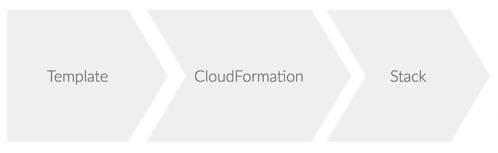
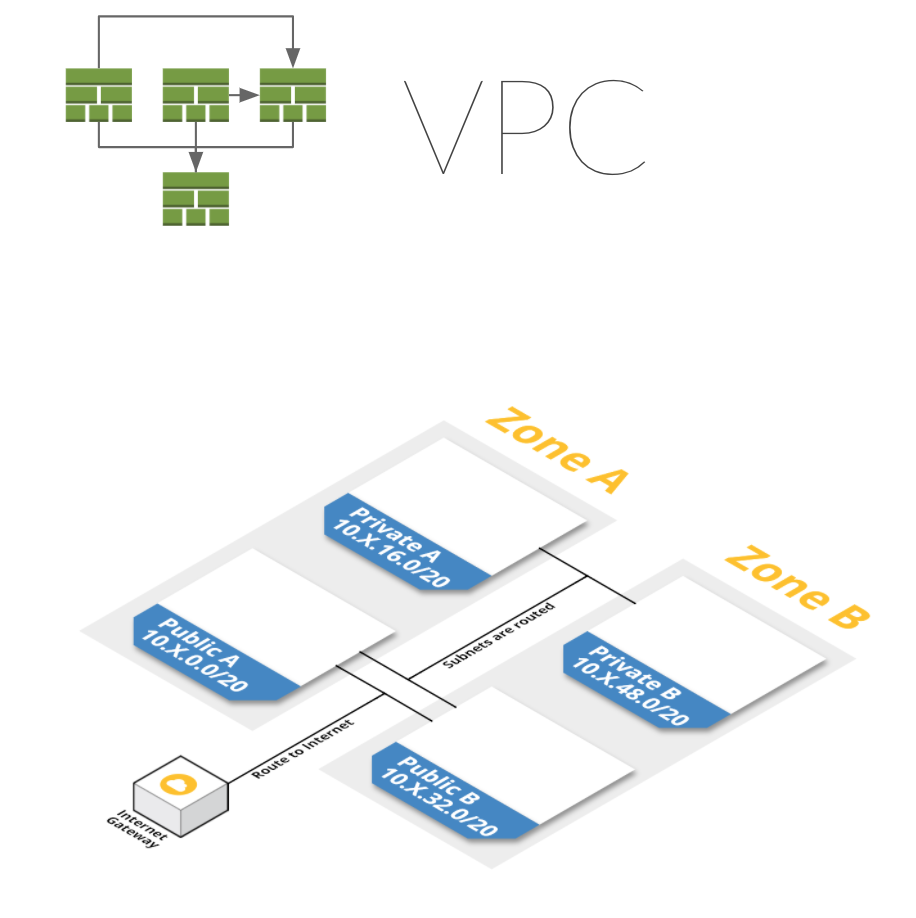
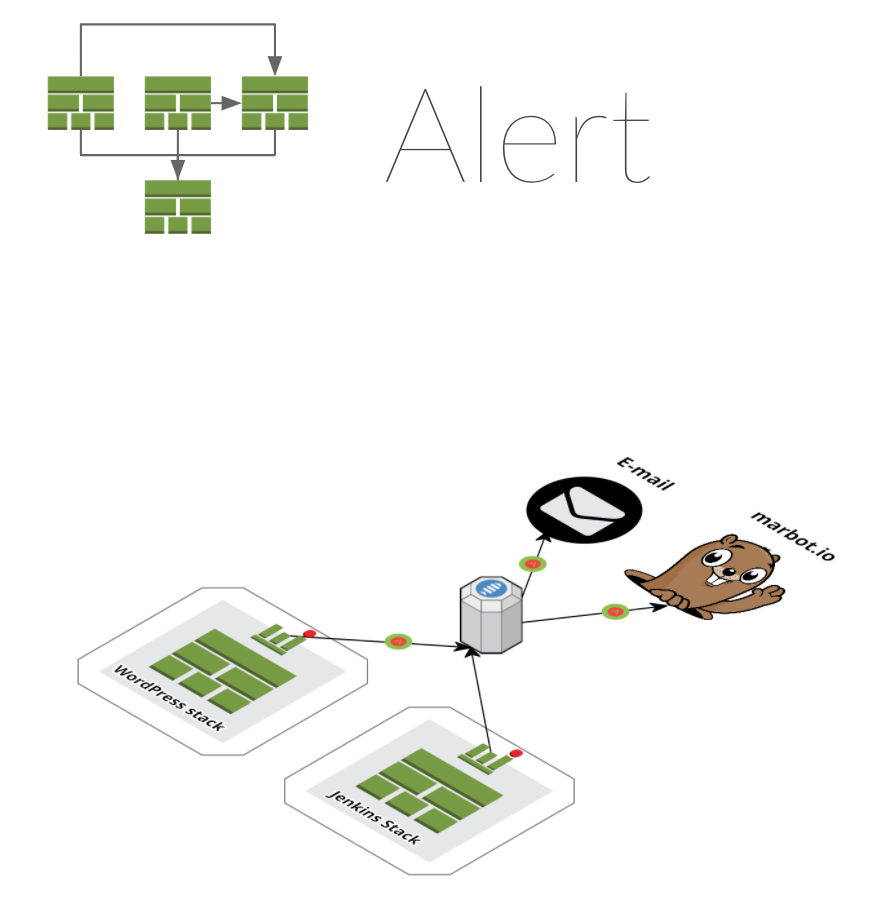
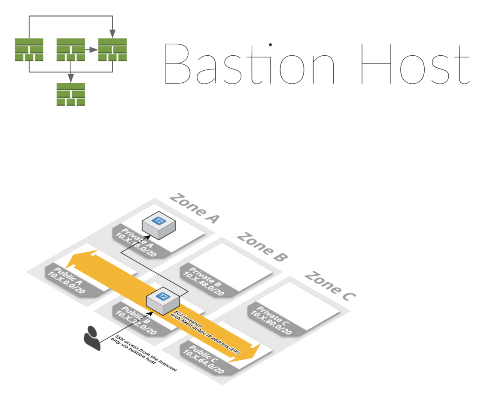

<iframe src="https://ghbtns.com/github-btn.html?user=widdix&repo=aws-cf-templates&type=star&count=true&size=large" frameborder="0" scrolling="0" width="160px" height="30px"></iframe>

Your source for free [AWS CloudFormation](https://aws.amazon.com/cloudformation/) templates. Bootstrap high-quality AWS infrastructure within minutes.

# Why Free Templates for AWS CloudFormation

* Speed up development and migration: reuse our templates to create complex environments for common use cases with ease.
* Rely on high-quality infrastructure templates: peer-reviewed by an expert (certified AWS solutions architect Professional) and verified with automated tests.
* All templates are production-ready. If no other limitations are documented, they are:
    * Highly available: no single point of failure
    * Scalable: increase or decrease the capacity based on utilization
    * Frictionless deployment: deliver new versions of your application automatically without downtime
    * Secure: using the latest operating systems and software components, follow the least privilege principle in all areas, backups enabled
    * Operations friendly: provide tools like logging, monitoring and alerting to recognize and debug problems
* Premium Support available: Get help in case of small and big emergencies and submit a feature request.

# Related projects

## widdix CLI
[widdix, a CLI tool to manage Free Templates for AWS CloudFormation](./cli/).

## cfn-modules
[Easy-going CloudFormation](https://github.com/cfn-modules/docs): Modular, production ready, open source.

# Infrastructure Templates
Choose from our template catalog:

* [Elastic Compute Cloud (EC2)](./ec2/)
* [EC2 Container Service (ECS)](./ecs/)
* [Jenkins ](./jenkins/)
* [Operations](./operations/)
* [Security](./security/)
* [State / Data](./state/)
* [Static Website](./static-website/)
* [Virtual Private Cloud (VPC)](./vpc/)
* [WordPress](./wordpress/)

# How does CloudFormation work

CloudFormation turns a template (JSON or YAML) into a stack like the following figure shows.

You can apply updates to an existing stack with an updated template. CloudFormation will figure out what needs to be changed.

**Never make manual changes to infrastructure managed by CloudFormation!**

# Example

Imagine you want to set up a Jenkins automation server. This project uses templates as modules to reuse infrastructure components. Some are optional, while others are required. The following figure shows templates that are needed to set up Jenkins.

If you create a stack, you sometimes have to supply parameters that start with `Parent`. That's the mechanism to pass dependent stacks into a stack.

Let's look at the first dependency.

## VPC dependency (required)

Many templates depend on a VPC stack. The VPC is a required dependency. 

## Alert dependency (optional)

If you want to receive alerts when things go wrong, you can optionally supply an alert stack. 

I highly recommend using an alert stack. Otherwise, you will not know when things go wrong (and they will!).

## SSH bastion host dependency (optional)

If you want to add some extra security, you can use an SSH bastion host.

The bastion host has a optional dependency on the alert stack. So if you want to receive alerts if your bastion hosts is in trouble, supply an alert stack.

## Jenkins

Finally, you can create the Jenkins stack.

The cool thing is that you can re-use the dependencies. E.g., you can use the same SSH bastion host for Jenkins and WordPress.

# License
All templates are published under Apache License Version 2.0.

## Help needed?
You will probably find an answer to your question on [Stack Overflow](https://stackoverflow.com/questions/tagged/amazon-cloudformation). If not, use the tag `amazon-cloudformation` to post your question, and the chances are high that we or someone from the community will point you in the right direction. We are not able to answer your questions via email or the project's issue tracker.

## Sponsor a feature or bug fix
Are you in need of a feature or does a bug cause you sleepless nights? Please let us know by using the project's [issue tracker](https://github.com/widdix/aws-cf-templates/issues). We work on bug fixes and new features as time permits. Are you in need of an urgent bug fix or important feature request? [Contact us](mailto:hello@widdix.net) to sponsor a feature or bug fix.

## Training and Consulting
Do you want to accelerate your start with AWS CloudFormation and our templates? We do offer remote and on-site training for you and your team. Are you looking for guidance on how to use or adapt our templates to your use case? We offer consulting services as well. [Contact us](mailto:hello@widdix.net), and we’ll accelerate your project.

# About
A [cloudonaut.io](https://cloudonaut.io/templates-for-aws-cloudformation/) project. Engineered by [widdix](https://widdix.net).
