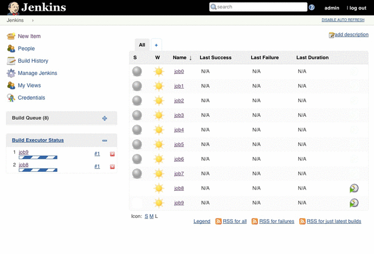
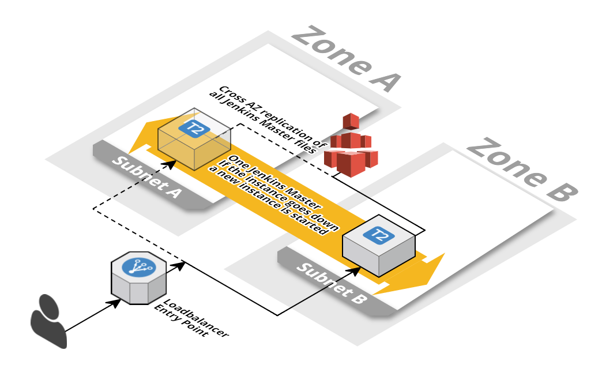

<iframe src="https://ghbtns.com/github-btn.html?user=widdix&repo=aws-cf-templates&type=star&count=true&size=large" frameborder="0" scrolling="0" width="160px" height="30px"></iframe>

> **New**: [Become a sponsor](https://github.com/sponsors/widdix) via GitHub Sponsors!

# Jenkins 2.0: highly available master
This template describes a Jenkins master in a highly available manner. If the master instance fails it will be replaced automatically. All data stored on EFS where it is replicated across AZs and the file system can grow without a limit. The Jenkins master sits behind a load balancer to provide a fixed endpoint. Logs from the operating system and Jenkins are pushed to CloudWatch Logs.

Amazon S3 URL: `https://s3-eu-west-1.amazonaws.com/widdix-aws-cf-templates-releases-eu-west-1/__VERSION__/jenkins/jenkins2-ha.yaml`

## Installation Guide
1. This template depends on one of our [`vpc-*azs.yaml`](./vpc/) templates. 
1. 
1. Click **Next** to proceed with the next step of the wizard.
1. Specify a name and all parameters for the stack.
1. Click **Next** to proceed with the next step of the wizard.
1. Click **Next** to skip the **Options** step of the wizard.
1. Check the **I acknowledge that this template might cause AWS CloudFormation to create IAM resources.** checkbox.
1. Click **Create** to start the creation of the stack.
1. Wait until the stack reaches the state **CREATE_COMPLETE**
1. Grab the `URL` of the Jenkins master from the **Outputs** tab of your stack.

## Dependencies
* `vpc/vpc-*azs.yaml` (**required**)
* `vpc/vpc-*-bastion.yaml` (recommended)
* `security/auth-proxy-*.yaml`
* `operations/alert.yaml` (recommended)

## Limitations
* Jenkins will only run in two Availability Zones, even if your VPC stack has more.

# Jenkins 2.0: highly available master and dynamic agents
This template describes a Jenkins master in a highly available manner. If the master instance fails it will be replaced automatically. All data stored on EFS where it is replicated across AZs and the file system can grow without a limit. The Jenkins master sits behind a load balancer to provide a fixed endpoint. A dynamic pool of agents will execute builds. If the build queue grows new agents are provisioned. Of the build queue is empty agents are taken offline (only if they have no build running). System and Jenkins logs are pushed to CloudWatch Logs.

Amazon S3 URL: `https://s3-eu-west-1.amazonaws.com/widdix-aws-cf-templates-releases-eu-west-1/__VERSION__/jenkins/jenkins2-ha-agents.yaml`

## Installation Guide
1. This template depends on one of our [`vpc-*azs.yaml`](./vpc/) templates. 
1. 
1. Click **Next** to proceed with the next step of the wizard.
1. Specify a name and all parameters for the stack.
1. Click **Next** to proceed with the next step of the wizard.
1. Click **Next** to skip the **Options** step of the wizard.
1. Check the **I acknowledge that this template might cause AWS CloudFormation to create IAM resources.** checkbox.
1. Click **Create** to start the creation of the stack.
1. Wait until the stack reaches the state **CREATE_COMPLETE**
1. Grab the `URL` of the Jenkins master from the **Outputs** tab of your stack.

## Dependencies
* `vpc/vpc-*azs.yaml` (**required**)
* `vpc/vpc-*-bastion.yaml` (recommended)
* `security/auth-proxy-*.yaml`
* `operations/alert.yaml` (recommended)

## Limitations
* Jenkins will only run in two Availability Zones, even if your VPC stack has more.
* Stack updates only work if no agents are running. Scale to zero agents before you update the stack!
