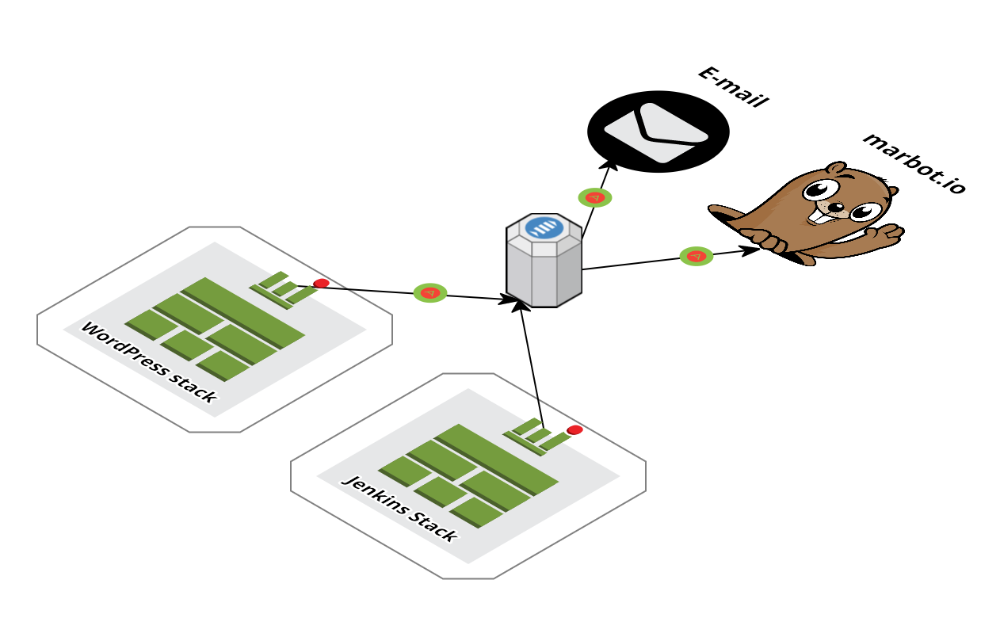

<iframe src="https://ghbtns.com/github-btn.html?user=widdix&repo=aws-cf-templates&type=star&count=true&size=large" frameborder="0" scrolling="0" width="160px" height="30px"></iframe>

> **New**: [Become a sponsor](https://github.com/sponsors/widdix) via GitHub Sponsors!

# Alert topic
This template describes a SNS topic that can be used by many other templates to receive alerts. You can add one or multiple subscribers to this topic and they will all receive the same alerts. Supported transports are:
* Email
* HTTP endpoint
* HTTPS endpoint (can be used by [marbot](https://marbot.io/?utm_source=templates&utm_medium=doc&utm_campaign=operations))

Amazon S3 URL: `https://s3-eu-west-1.amazonaws.com/widdix-aws-cf-templates-releases-eu-west-1/__VERSION__/operations/alert.yaml`

## marbot

AWS Monitoring from Slack and Microsoft Teams. Configure monitoring, receive alerts, solve incidents.

marbot sets up CloudWatch Alarms and EventBridge Rules for all parts of your AWS infrastructure. CloudFormation and Terraform are supported.

Your team receives alerts as direct messages or channel messages via Slack. The alert includes relevant details to understand and solve the problem. Use different Slack channels to separate prod from dev alerts. Only get alerted when necessary. To avoid a flood of alarms, marbot groups similar events.

Strong integrations with AWS and 3rd party services: AMI, Auto Scaling, Budget, CloudFormation, CloudWatch Alarms, CloudWatch Events, CodePipeline, DynamoDB, EC2, Elastic Beanstalk, ElastiCache, ELB, EMR, KMS, Lambda, RDS, S3, SES, SNS, Trusted Advisor, X-Ray, Bitbucket, Email, HTTP(S), Jenkins, New Relic, RSS Feed, Sumo Logic, Uptime Robot, ...

marbot escalates an alert to a single team member. Each alert can either be acknowledged, passed on, or closed. Unnoticed alerts are escalated to another team member or the whole crew if needed.

marbot adds Quick Links pointing to the AWS Management Console automatically. marbot attaches runbooks to provide structured procedures to respond to incidents as well.

Each week, marbot rewards team members for closing alerts. The detailed statistics help you to optimize your alert configuration as well.

[Try marbot for free now!](https://marbot.io/?utm_source=templates&utm_medium=doc&utm_campaign=operations)

## Installation Guide
1. 
1. Click **Next** to proceed with the next step of the wizard.
1. Specify a name and all parameters for the stack.
1. Click **Next** to proceed with the next step of the wizard.
1. Click **Next** to skip the **Options** step of the wizard.
1. Check the **I acknowledge that this template might cause AWS CloudFormation to create IAM resources.** checkbox.
1. Click **Create** to start the creation of the stack.
1. Wait until the stack reaches the state **CREATE_COMPLETE**

# Access Logs Anonymizer

IPv4 addresses are anonymized to `XXX.YYY.ZZZ.0` and IPv6 addresses to `XXXX:YYYY::`.

Access logs are stored in S3 buckets (created via [state/s3](./state/#s3)). The following order of creation is recommended:

1. Create [S3 Bucket](./state/#s3) stack.
2. Create Access Logs Anonymizer stack.
3. Update S3 Bucket stack and set the parameter **LambdaFunctionArn** to the **FunctionARN** output of the Access Logs Anonymizer stack.

## CloudFront
This template describes a Lambda function that can be used to anonymize IP addresses in CloudFront access logs. 

Amazon S3 URL: `https://s3-eu-west-1.amazonaws.com/widdix-aws-cf-templates-releases-eu-west-1/__VERSION__/operations/cloudfront-access-logs-anonymizer.yaml`

## Installation Guide
1. This template depends on our `state/s3.yaml` template. 
1. 
1. Click **Next** to proceed with the next step of the wizard.
1. Specify a name and all parameters for the stack.
1. Click **Next** to proceed with the next step of the wizard.
1. Click **Next** to skip the **Options** step of the wizard.
1. Check the **I acknowledge that this template might cause AWS CloudFormation to create IAM resources.** checkbox.
1. Click **Create** to start the creation of the stack.
1. Wait until the stack reaches the state **CREATE_COMPLETE**
1. Update S3 Bucket stack and set the parameter **LambdaFunctionArn** to the **FunctionARN** output of the Access Logs Anonymizer stack.

### Dependencies
* `state/s3.yaml` (**required**)
* `operations/alert.yaml` (recommended)

## ALB
This template describes a Lambda function that can be used to anonymize IP addresses in ALB access logs. 

Amazon S3 URL: `https://s3-eu-west-1.amazonaws.com/widdix-aws-cf-templates-releases-eu-west-1/__VERSION__/operations/alb-access-logs-anonymizer.yaml`

## Installation Guide
1. This template depends on our `state/s3.yaml` template. 
1. 
1. Click **Next** to proceed with the next step of the wizard.
1. Specify a name and all parameters for the stack.
1. Click **Next** to proceed with the next step of the wizard.
1. Click **Next** to skip the **Options** step of the wizard.
1. Check the **I acknowledge that this template might cause AWS CloudFormation to create IAM resources.** checkbox.
1. Click **Create** to start the creation of the stack.
1. Wait until the stack reaches the state **CREATE_COMPLETE**
1. Update S3 Bucket stack and set the parameter **LambdaFunctionArn** to the **FunctionARN** output of the Access Logs Anonymizer stack.

### Dependencies
* `state/s3.yaml` (**required**)
* `operations/alert.yaml` (recommended)

# GitHub OpenID Connect

Allow [GitHub Actions to assume IAM Roles](https://docs.github.com/en/actions/deployment/security-hardening-your-deployments/configuring-openid-connect-in-amazon-web-services#updating-your-github-actions-workflow) in your AWS account without IAM users.

Amazon S3 URL: `https://s3-eu-west-1.amazonaws.com/widdix-aws-cf-templates-releases-eu-west-1/__VERSION__/operations/github-openid-connect.yaml`

## Installation Guide
1. 
1. Click **Next** to proceed with the next step of the wizard.
1. Specify a name and all parameters for the stack.
1. Click **Next** to proceed with the next step of the wizard.
1. Click **Next** to skip the **Options** step of the wizard.
1. Check the **I acknowledge that this template might cause AWS CloudFormation to create IAM resources.** checkbox.
1. Click **Create** to start the creation of the stack.
1. Wait until the stack reaches the state **CREATE_COMPLETE**

# Terraform State

Creates S3 bucket and DynamoDB table used to manage remote Terraform state.

Amazon S3 URL: `https://s3-eu-west-1.amazonaws.com/widdix-aws-cf-templates-releases-eu-west-1/__VERSION__/operations/terraform-state.yaml`

## Installation Guide
1. This template depends on our `security/kms.yaml` template. 
1. 
1. Click **Next** to proceed with the next step of the wizard.
1. Specify a name and all parameters for the stack.
1. Click **Next** to proceed with the next step of the wizard.
1. Click **Next** to skip the **Options** step of the wizard.
1. Click **Create** to start the creation of the stack.
1. Wait until the stack reaches the state **CREATE_COMPLETE**

> Be aware that the template creates a bucket policy using a `Deny` statement with a `NotPrincipal` element when defining the `TerraformStateUserARNs` and `TerraformStateAdminARNs` parameters. Therefore, both parameters should include the following inforamtion: account ARN (e.g., `arn:aws:iam::111111111111:root`), IAM user (e.g., `arn:aws:iam::111111111111:user/tfuser`), IAM role (e.g., `arn:aws:iam::111111111111:role/tfadmin`) and assumed-role user (e.g., `arn:aws:sts::111111111111:assumed-role/tfadmin/session`). Check out [NotPrincipal with Deny](https://docs.aws.amazon.com/IAM/latest/UserGuide/reference_policies_elements_notprincipal.html#specifying-notprincipal-allow) to learn more.

### Dependencies
* `security/kms-key.yaml` (**required**)
