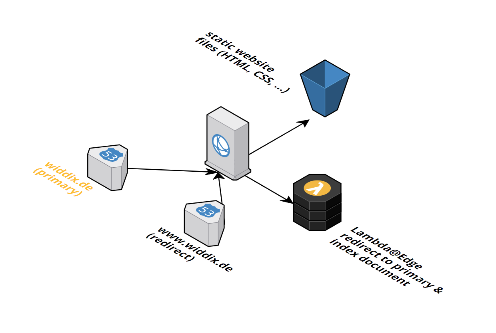

<iframe src="https://ghbtns.com/github-btn.html?user=widdix&repo=aws-cf-templates&type=star&count=true&size=large" frameborder="0" scrolling="0" width="160px" height="30px"></iframe>

> **New**: [Become a sponsor](https://github.com/sponsors/widdix) via GitHub Sponsors!

# Static website with CDN
This template describes the infrastructure for hosting a static website over HTTPS behind a CDN.

## Index Document / Default Root Object

S3 and CloudFront behave differently when it comes to index document support in subdirectories. You might expect that if you have a subdirectory (e.g. `folder`) with a `index.html` file inside, that you get the file if you make a HTTP request to `/folder/`. Unfortunately, that's not the default behavior of CloudFront but there is a workaround using Lambda@Edge.

### S3 Website Hosting behavior with Index Document (not provided by the template!)

| Resource             | Response                   | Comment                                                                                     |
| -------------------- | -------------------------- | ------------------------------------------------------------------------------------------- |
| `/`                  | 200 Content of index.html  |                                                                                             |
| `/index.html`        | 200 Content of index.html  | Not SEO friendly because of duplicate content on `/`, should redirect to `/`                |
| `/folder`            | 302 Redirect to `/folder/` |                                                                                             |
| `/folder/`           | 200 Content of index.html  |                                                                                             |
| `/folder/index.html` | 200 Content of index.html  | Not SEO friendly because of duplicate content on `/folder/`, should redirect to `/folder/`  |

### CloudFront with Default Root Object (provided by the template static-website.yaml template)

| Resource             | Response                   | Comment                                                                                     |
| -------------------- | -------------------------- | ------------------------------------------------------------------------------------------- |
| `/`                  | 200 Content of index.html  |                                                                                             |
| `/index.html`        | 200 Content of index.html  | Not SEO friendly because of duplicate content on `/`, should redirect to `/`                |
| `/folder`            | 403 Error                  | Not user friendly                                                                           |
| `/folder/`           | 403 Error                  | Not user friendly                                                                           |
| `/folder/index.html` | 200 Content of index.html  | Not user friendly                                                                           |

### Lambda@Edge solution (provided by the template static-website.yaml and lambdaedge-index-document.yaml template)

To improve the default CloudFront behavior, we developed a Lambda@Edge solution that gives you the following search engine optimized result.

| Resource             | Response                   |
| -------------------- | -------------------------- |
| `/`                  | 200 Content of index.html  |
| `/index.html`        | 302 Redirect to `/`        |
| `/folder`            | 302 Redirect to `/folder/` |
| `/folder/`           | 200 Content of index.html  |
| `/folder/index.html` | 302 Redirect to `/folder/` |

Amazon S3 URL: `https://s3-eu-west-1.amazonaws.com/widdix-aws-cf-templates-releases-eu-west-1/__VERSION__/static-website/static-website.yaml`

## Installation Guide

1. Switch to the us-east-1 (N. Virginia) region.
1. 
1. Click **Next** to proceed with the next step of the wizard.
1. Specify a name and all parameters for the stack.
1. Click **Next** to proceed with the next step of the wizard.
1. Click **Next** to skip the **Options** step of the wizard.
1. Check the **I acknowledge that this template might cause AWS CloudFormation to create IAM resources.** checkbox.
1. Click **Create** to start the creation of the stack.
1. Wait until the stack reaches the state **CREATE_COMPLETE**
1. Copy the `ViewerRequestLambdaEdgeFunctionVersionARN` output of the stack.
1. Switch to the region where you want to S3 bucket with static files to be created in (we recommend the use the us-east-1 (N. Virginia) region if possible).
1. This template depends on one of our [`zone-*.yaml`](./vpc/) templates. 
1. 
1. Click **Next** to proceed with the next step of the wizard.
1. Specify a name and all parameters for the stack.
    a. Set the `ViewerRequestLambdaEdgeFunctionVersionARN` to the value of the `ViewerRequestLambdaEdgeFunctionVersionARN` output from the `lambdaedge-index-document` stack. 
1. Click **Next** to proceed with the next step of the wizard.
1. Click **Next** to skip the **Options** step of the wizard.
1. Check the **I acknowledge that this template might cause AWS CloudFormation to create IAM resources.** checkbox.
1. Click **Create** to start the creation of the stack.
1. Wait until the stack reaches the state **CREATE_COMPLETE**

> If you deployed the previous stack **not** to the us-east-1 (N. Virginia) region you need to deploy a monitoring stack to us-east-1 (N. Virginia)! [Launch Stack](https://console.aws.amazon.com/cloudformation/home?region=us-east-1#/stacks/create/review?templateURL=https://s3-eu-west-1.amazonaws.com/widdix-aws-cf-templates-releases-eu-west-1/__VERSION__/static-website/monitoring.yaml&stackName=static-website-monitoring)

## Dependencies
* `vpc/zone-*.yaml` (**required**)
* `operations/alert.yaml` (recommended)
* `state/s3.yaml` (recommended)
* `security/waf.yaml`
