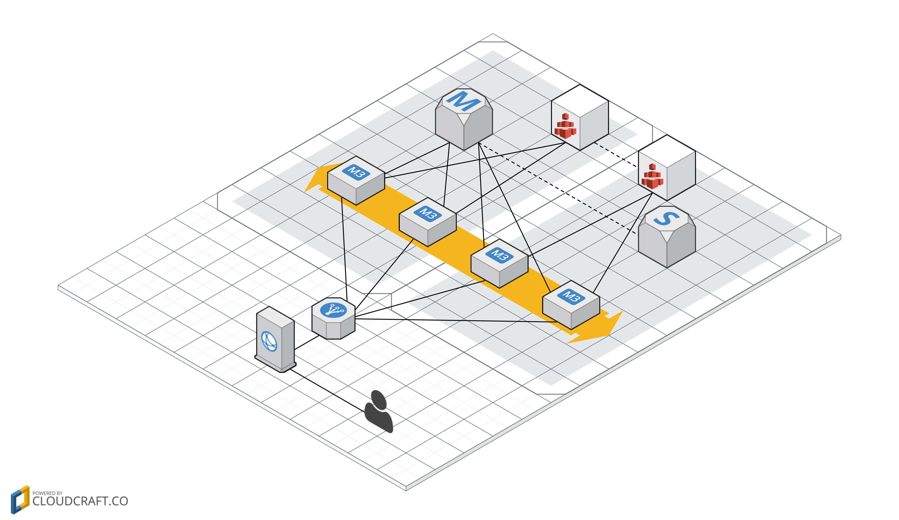

<iframe src="https://ghbtns.com/github-btn.html?user=widdix&repo=aws-cf-templates&type=star&count=true&size=large" frameborder="0" scrolling="0" width="160px" height="30px"></iframe>

# WordPress: fault tolerant and scalable (MySQL)
Use this CloudFormation template to create a fault tolerant and scalable WordPress environment on AWS running on MySQL.

## Features
* HTTPS only
* CDN caching static files
* Scalable file storage
* Fault tolerance due to multi-AZ setup

## Services
This template combines the following services:
* CloudFront: CDN for dynamic and static content
* ELB: load balancer forwarding requests to EC2 instances and terminating SSL
* EC2: virtual machines running the web servers
* EFS: storage for WordPress files (WordPress core, plugins, themes, user uploads, ...)
* RDS: MySQL database

## Installation Guide

*Important: A custom domain name (e.g. `www.yourdomain.com`) is needed before installing Wordpress based on this template.* 

1. This templates depends on our [`vpc-*azs.yaml`](../vpc/) template. 
1. Create an ACM certificate for your custom domain name within the region you want to launch your stack in. Copy the ARN of the certificate. This is for the ELB.
1. Create another ACM certificate for your custom domain name in region `us-east-1`. Copy the ARN of the certificate. This is for CloudFront (note: [CloudFront only supports ACM certificates in us-east-1](https://docs.aws.amazon.com/acm/latest/userguide/acm-services.html))
1. 
1. Click **Next** to proceed with the next step of the wizard.
1. Specify a name and all parameters for the stack.
1. Click **Next** to proceed with the next step of the wizard.
1. Click **Next** to skip the **Options** step of the wizard.
1. Check the **I acknowledge that this template might cause AWS CloudFormation to create IAM resources.** checkbox.
1. Click **Create** to start the creation of the stack.
1. Wait until the stack reaches the state **CREATE_COMPLETE**
1. Copy the value of `CloudFrontDomainName` from the **Outputs** tab of your stack.
1. Create or update a CNAME/Alias record for your custom domain name pointing to the `CloudFrontDomainName` from the previous step.

## Dependencies
* `vpc/vpc-*azs.yaml` (**required**)
* `vpc/vpc-ssh-bastion.yaml` (recommended)
* `security/auth-proxy-*.yaml`
* `operations/alert.yaml` (recommended)

## Limitations
* WordPress will only run in two Availability Zones, even if your VPC stack has more.
* PHP files are cached for 300 seconds on the web servers.
* Static files `wp-includes` and `wp-content` are cached for 15 minutes on the CDN.
* Pre-defined auto-scaling might not be able to cover your requirements and needs load and performance testing.

# WordPress: fault tolerant and scalable (Aurora)
Use this CloudFormation template to create a fault tolerant and scalable WordPress environment on AWS running on Aurora.

> 3 or more AZs required

## Features
* HTTPS only
* CDN caching static files
* Scalable file storage
* Fault tolerance due to multi-AZ setup

## Services
This template combines the following services:
* CloudFront: CDN for dynamic and static content
* ELB: load balancer forwarding requests to EC2 instances and terminating SSL
* EC2: virtual machines running the web servers
* EFS: storage for WordPress files (WordPress core, plugins, themes, user uploads, ...)
* RDS: Aurora database

## Installation Guide

*Important: A custom domain name (e.g. `www.yourdomain.com`) is needed before installing Wordpress based on this template.* 

1. This templates depends on our [`vpc-*azs.yaml`](../vpc/) template. 
1. Create an ACM certificate for your custom domain name within the region you want to launch your stack in. Copy the ARN of the certificate. This is for the ELB.
1. Create another ACM certificate for your custom domain name in region `us-east-1`. Copy the ARN of the certificate. This is for CloudFront (note: [CloudFront only supports ACM certificates in us-east-1](https://docs.aws.amazon.com/acm/latest/userguide/acm-services.html))
1. 
1. Click **Next** to proceed with the next step of the wizard.
1. Specify a name and all parameters for the stack.
1. Click **Next** to proceed with the next step of the wizard.
1. Click **Next** to skip the **Options** step of the wizard.
1. Check the **I acknowledge that this template might cause AWS CloudFormation to create IAM resources.** checkbox.
1. Click **Create** to start the creation of the stack.
1. Wait until the stack reaches the state **CREATE_COMPLETE**
1. Copy the value of `CloudFrontDomainName` from the **Outputs** tab of your stack.
1. Create or update a CNAME/Alias record for your custom domain name pointing to the `CloudFrontDomainName` from the previous step.

## Dependencies
* `vpc/vpc-*azs.yaml` (**required, 3 or more AZs required**)
* `vpc/vpc-ssh-bastion.yaml` (recommended)
* `security/auth-proxy-*.yaml`
* `operations/alert.yaml` (recommended)

## Limitations
* WordPress will only run three Availability Zones, even if your VPC stack has more.
* PHP files are cached for 300 seconds on the web servers.
* Static files `wp-includes` and `wp-content` are cached for 15 minutes on the CDN.
* Pre-defined auto-scaling might not be able to cover your requirements and needs load and performance testing.
